# pythonDSAlgoPractices
Udemy course for DS Algo using Python

## Tree

### Definition of Tree
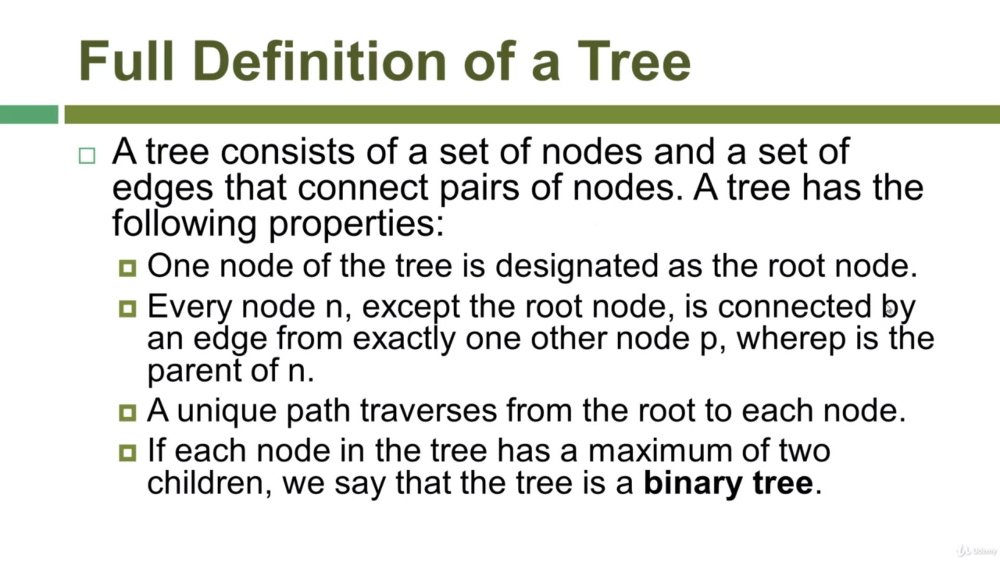

### Recursion Definition of Tree
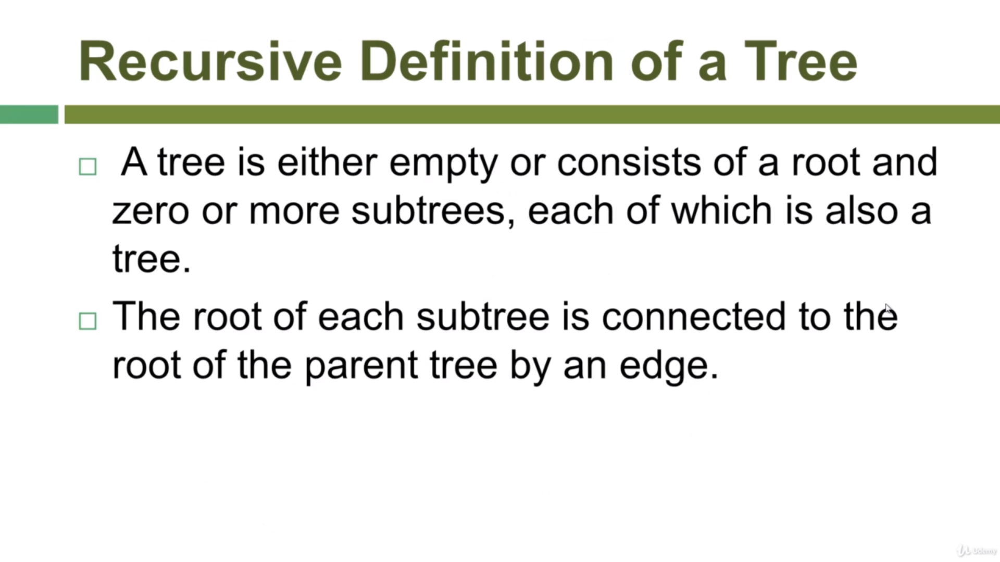
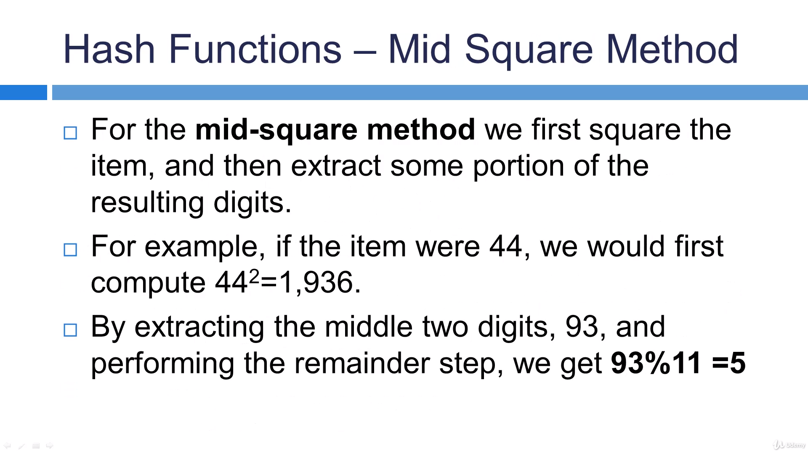

### Terminology in Trees
#### 1. 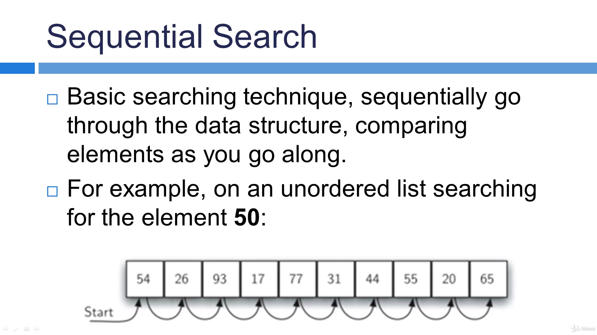
#### 2. 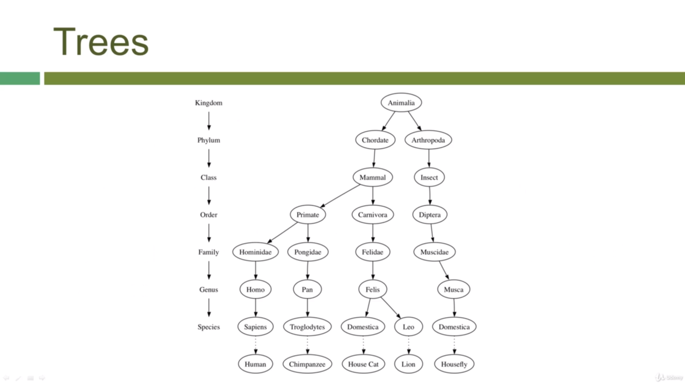
#### 3. 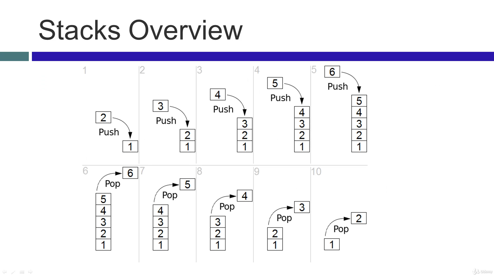
#### 4. 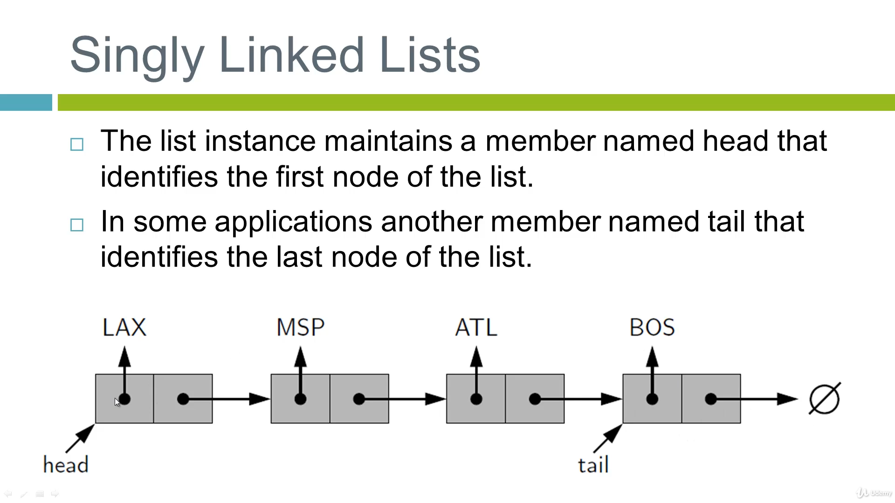
#### 5. 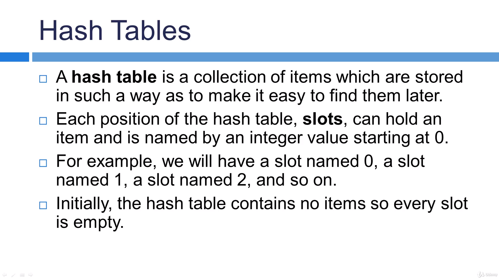
#### 6. 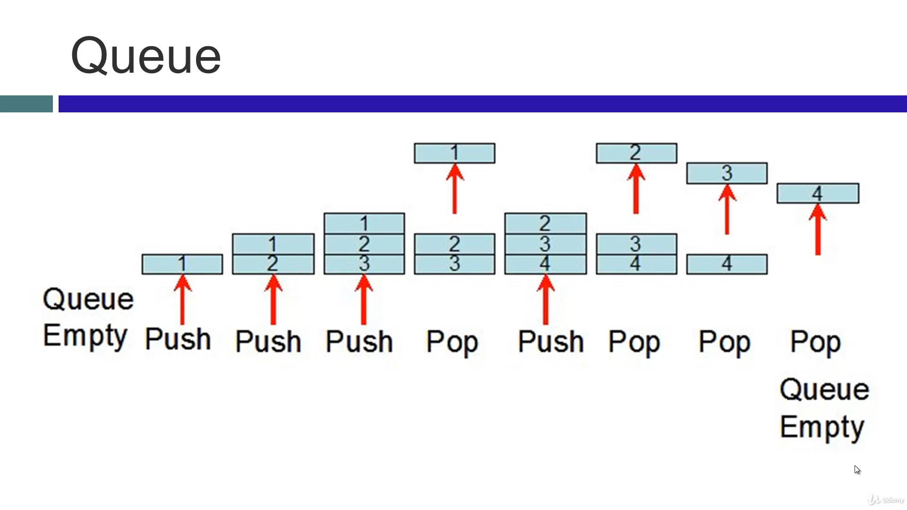
#### 7. 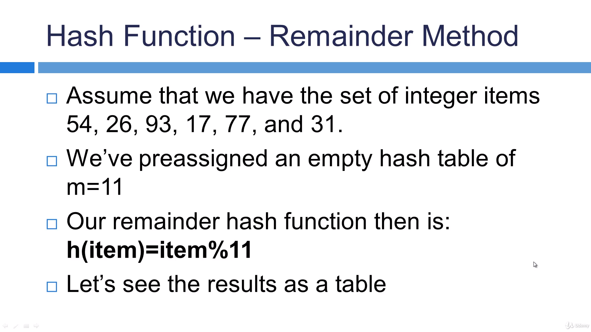
#### 8. 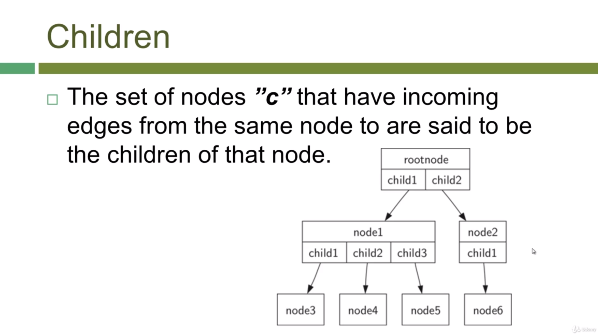
#### 9. 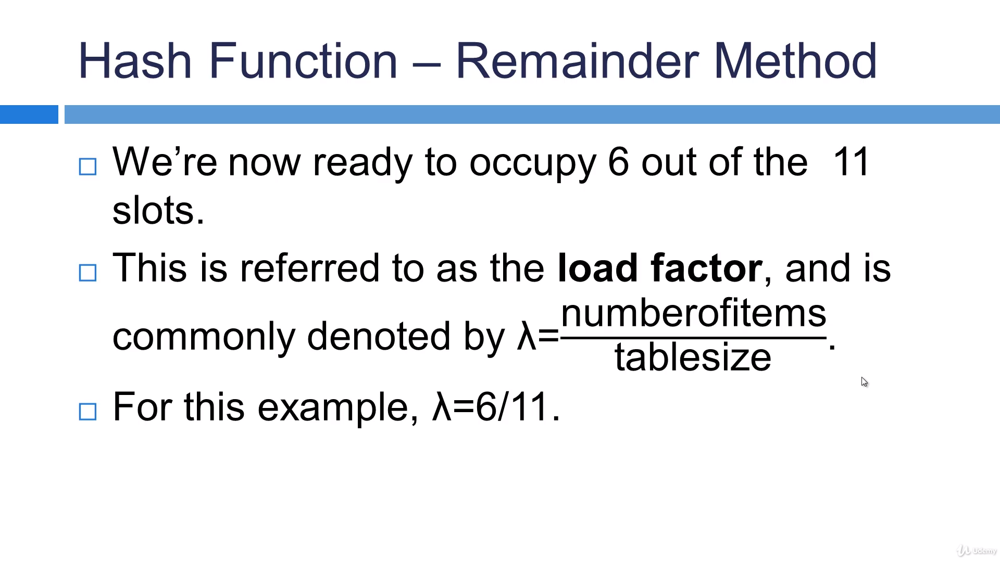
#### 10. 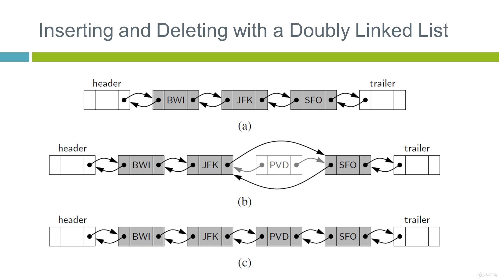
#### 11. 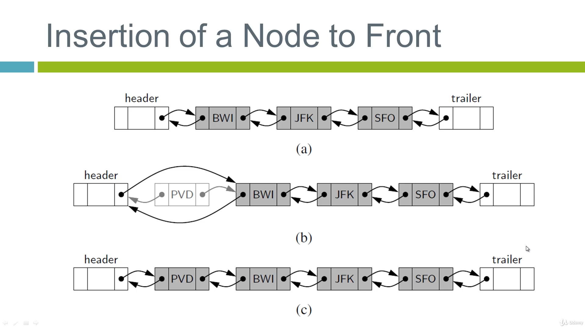
#### 12. 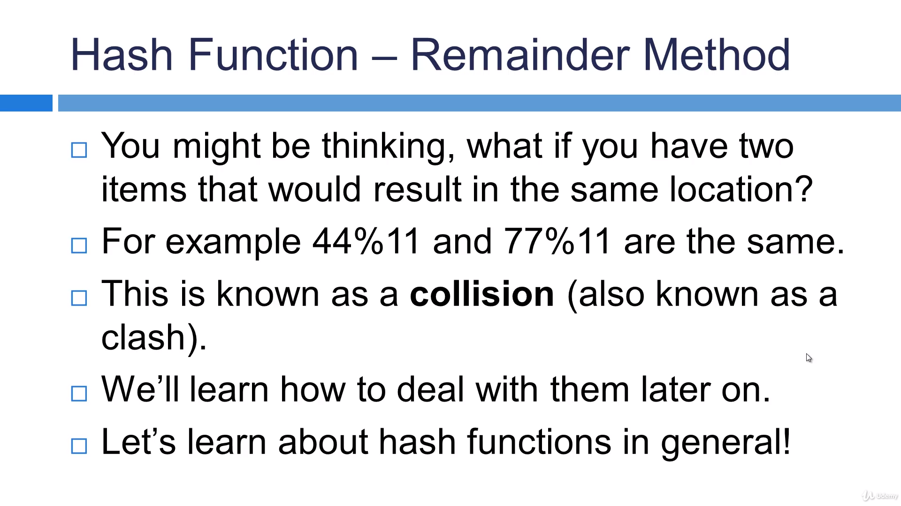
#### 13. 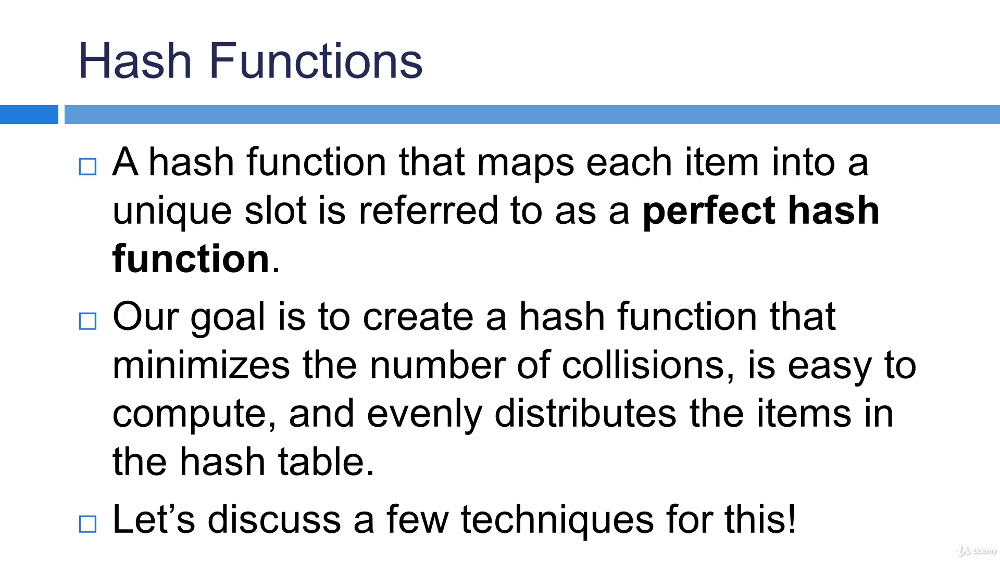
#### 14. 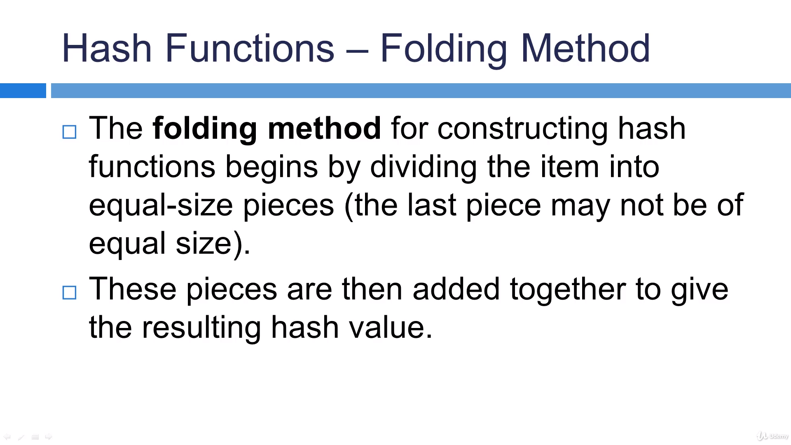
