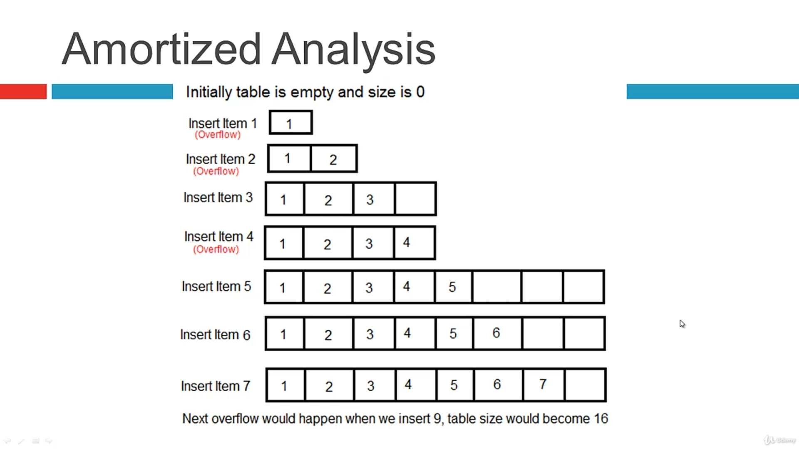
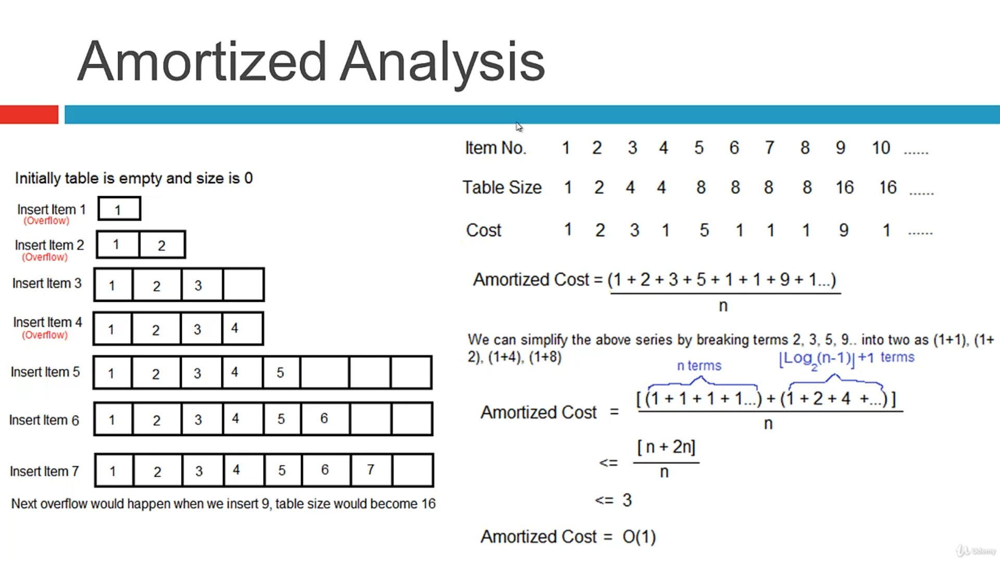

# pythonDSAlgoPractices
Udemy course for DS Algo using Python

### Dynamic Array : 
1. While appending Python allocates memory in chunks for ex 
3. Length :   0; Size in bytes:   56
4.Length :   1; Size in bytes:   88 
4. Length :   2; Size in bytes:   88 
5. Length :   3; Size in bytes:   88 
6. Length :   4; Size in bytes:   88 
7. Length :   5; Size in bytes:  120 
8. Length :   6; Size in bytes:  120 
9. Length :   7; Size in bytes:  120 
10. Length :   8; Size in bytes:  120 
11. Length :   9; Size in bytes:  184 
12. Length :  10; Size in bytes:  184

### Dynamic Array Implementation : 

### Amortized Analysis

#### Amortized process
