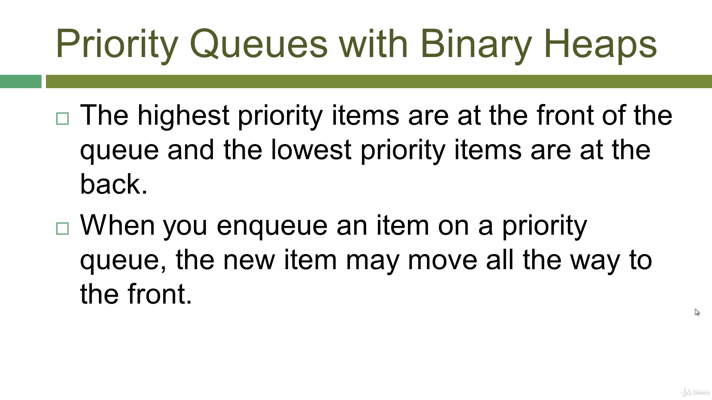
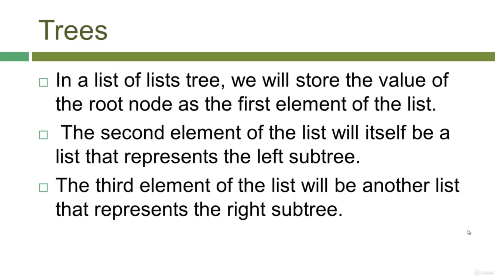
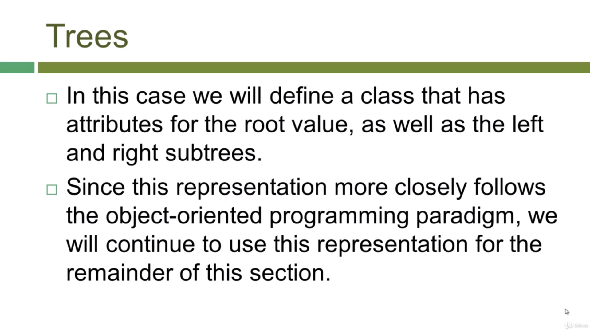
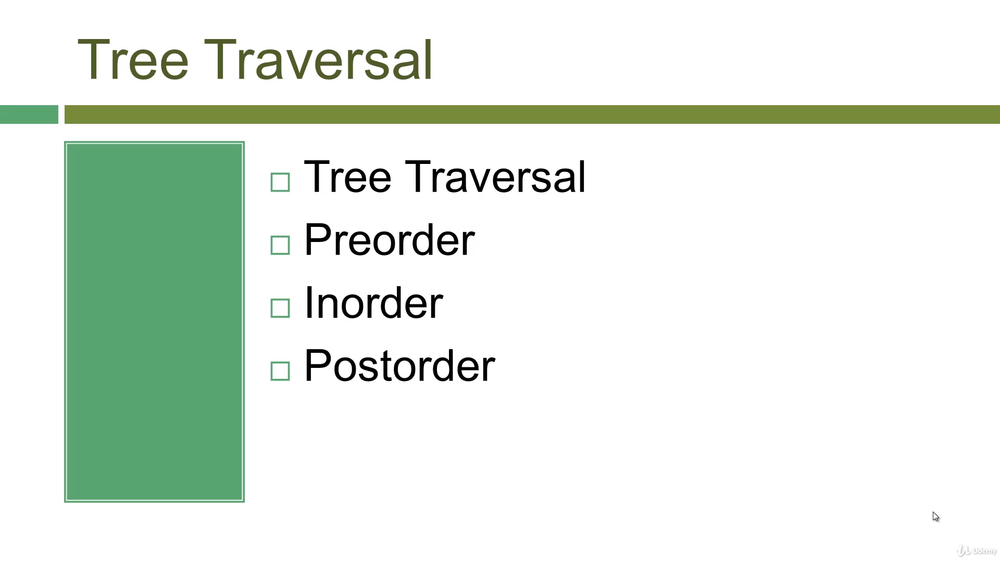
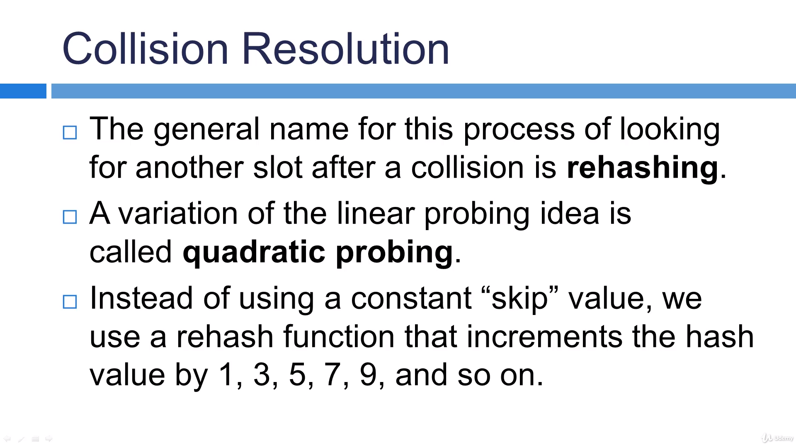
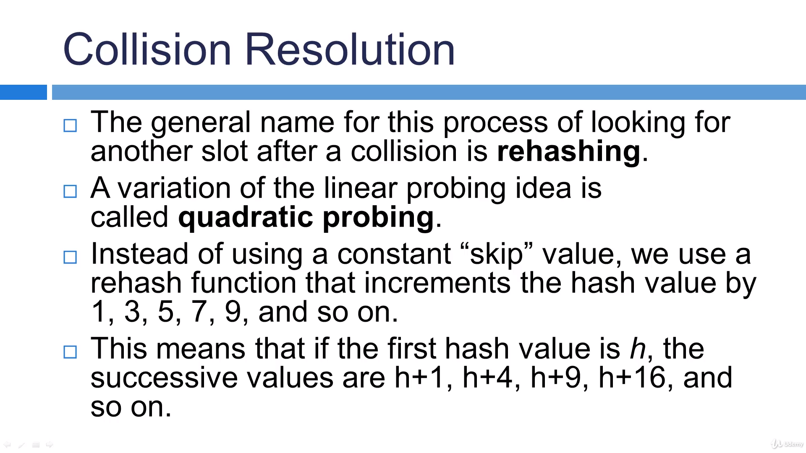
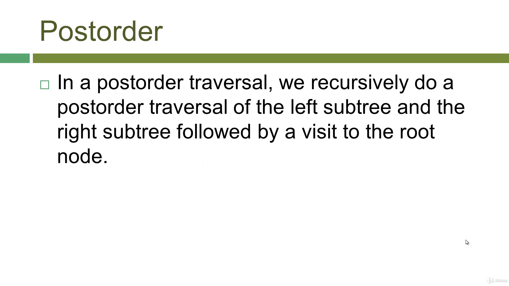
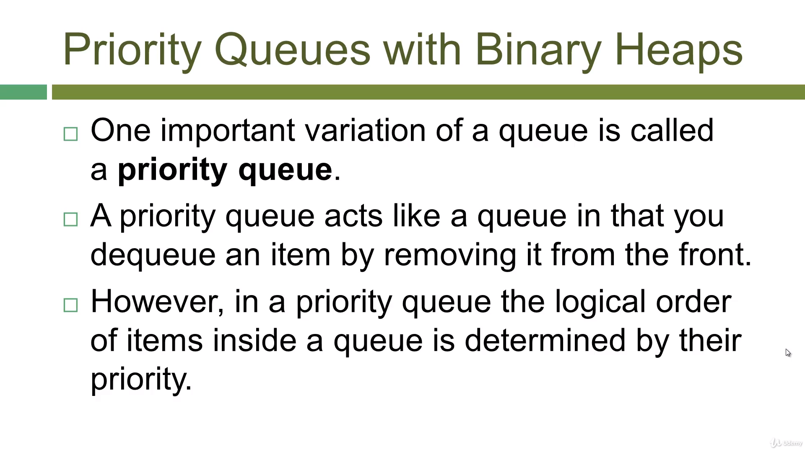

# pythonDSAlgoPractices

Udemy course for DS Algo using Python

## Searching and Sorting

### Types of searching techniques

#### Sequential Search
1. 

#### Binary Search
1. 
2. 
3. 
#### Hash tables 

1. 
2. Examples :
    1. 
    2. 
    3. 
    4. 
    5. 
    6. 
#### Hash Functions 

1. 
    1. 
    2. 
2. 
3. 
4. 
#### Collision Solution
1. 
2. 
3. 
4. 
5. 
