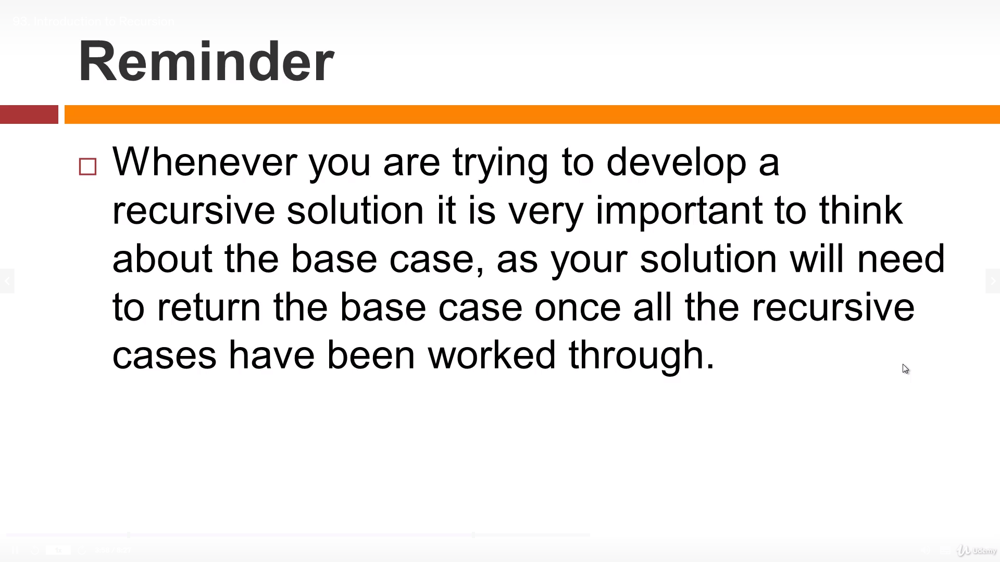
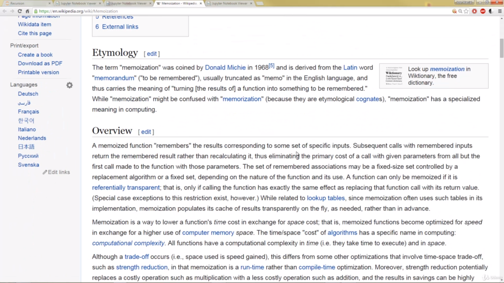
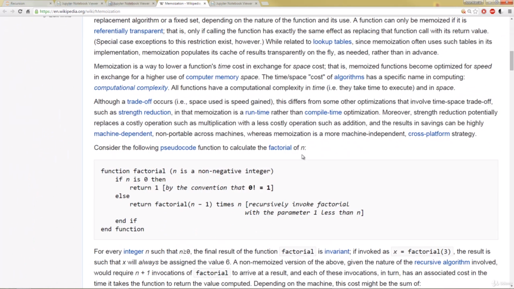
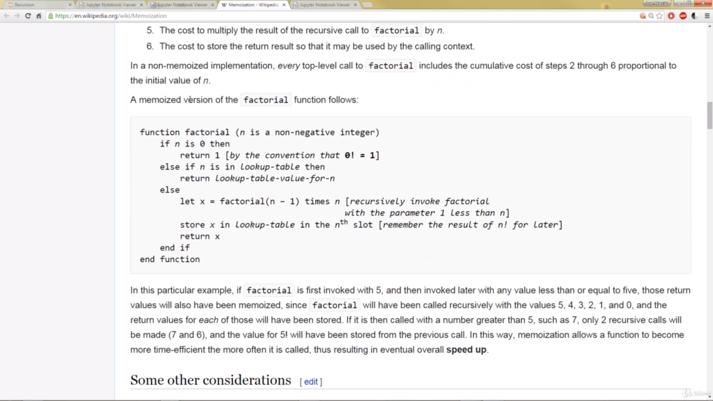

# pythonDSAlgoPractices
Udemy course for DS Algo using Python

## Recursion

### For Refernce see : 
    `[01-Introduction to Recursion.ipynb](..%2FPython-for-Algorithms--Data-Structures--and-Interviews%2F05-Recursion%2F01-Introduction%20to%20Recursion.ipynb)
### 
### Factorial ex

## Memoization
### Overview

